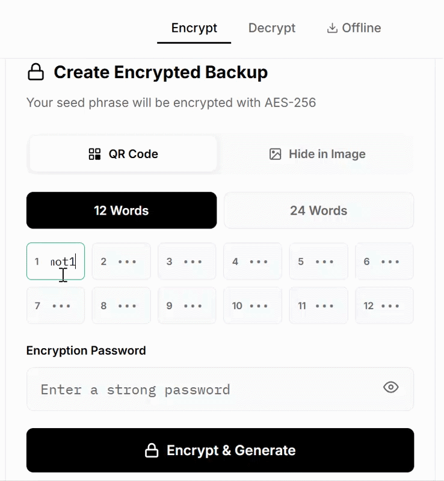
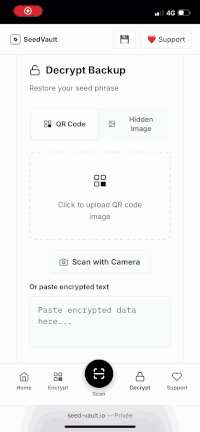
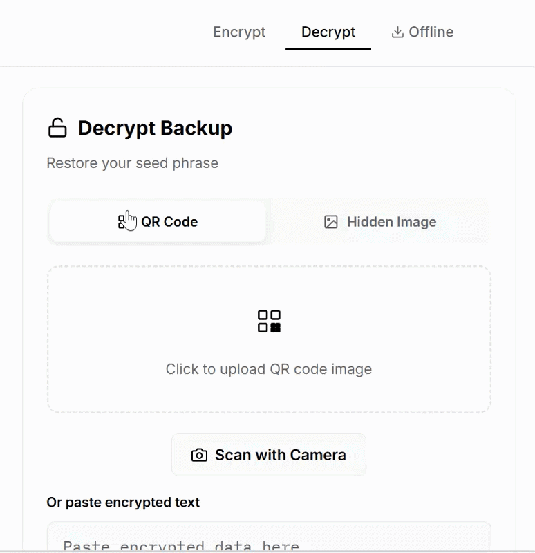

<p align="center">
  
</p>

<h1 align="center">SeedVault</h1>

<p align="center">
  <strong>Encrypt your crypto seed phrase into a QR code.</strong><br>
  AES-256-GCM · PBKDF2 600k · 100% client-side · Single HTML file · Works offline
</p>

<p align="center">
  <a href="https://seed-vault.io">Live App</a> &nbsp;·&nbsp;
  <a href="#security">Security</a> &nbsp;·&nbsp;
  <a href="#steganography">Steganography</a> &nbsp;·&nbsp;
  <a href="#how-it-works">How it works</a> &nbsp;·&nbsp;
  <a href="https://twitter.com/seed_vaultio">Twitter</a>
</p>

<p align="center">
  
  
  
  
  
  
</p>

---

## The problem

Most crypto holders store their seed phrase in **plain text** — written on paper, stamped on metal, saved in a screenshot. Anyone who finds it can steal everything, instantly.

Even metal plates (Cryptosteel, Billfodl, etc.) only protect against fire and water. They don't protect against **the person who finds the plate**.

## The solution

SeedVault encrypts your seed phrase **before** you store it.

The result is an encrypted QR code. You can print it, save it on USB, email it to yourself, or engrave it on metal — without the password, it's unreadable noise.

## Demo

### Encrypt

<p align="center">
  
  <br>
  <em>Enter your words → choose a password → encrypted QR code. 10 seconds.</em>
</p>

### Decrypt — Mobile

Scan the QR code directly with your phone camera, enter your password, and your seed phrase is restored instantly.

<p align="center">
  
  <br>
  <em>Open camera → scan QR → enter password → done.</em>
</p>

### Decrypt — Desktop

Upload your QR code image (or paste the encrypted text), enter your password, and recover your seed phrase.

<p align="center">
  
  <br>
  <em>Upload QR image → enter password → seed phrase restored.</em>
</p>

## Features

**Encryption** — AES-256-GCM via Web Crypto API. PBKDF2 key derivation with 600,000 iterations. Random 16-byte salt and 12-byte IV per encryption.

**Single HTML file** — No build step, no server, no dependencies. Download `index.html`, open in any browser. That's it.

**Works offline** — Disconnect from the internet before encrypting. The tool works identically.

**Steganography** — Hide your encrypted seed phrase inside a normal-looking image. The image looks unchanged to the human eye. See [Steganography](#steganography) below.

**Camera scanner** — Scan encrypted QR codes directly with your phone camera (HTTPS required) or upload an image.

**Dark/light mode** — Follows your system preference automatically.

**BIP39 validation** — Real-time word validation against the official BIP39 wordlist. Invalid words are flagged before encryption.

## Steganography

This is one of SeedVault's most powerful features. Instead of storing your seed phrase as a visible QR code, you can **hide it inside any image**.

```
Your photo of a sunset
      ↓
AES-256-GCM encryption + pixel embedding
      ↓
The same photo — looks identical to the human eye
      ↓
But contains your encrypted seed phrase in the pixel data
```

**Why this matters:**
- A QR code on your desk says "I have crypto" — a photo of your cat says nothing
- Safe to store on USB drives, cloud storage, or email to yourself
- Even if someone finds the image, they don't know it contains data
- Even if they suspect it, the data is AES-256 encrypted
- Double protection: **invisible** AND **encrypted**

## How it works

```
Your seed phrase
      ↓
AES-256-GCM encryption (in your browser)
      ↓                ↑
  Encrypted data    Your password
      ↓            (never stored)
   QR code
      ↓
Print · USB · Cloud · Metal
```

1. You enter your 12 or 24 words
2. You choose a password
3. SeedVault generates a random **salt** (16 bytes) and **IV** (12 bytes)
4. Your password is derived into an encryption key via **PBKDF2** (600,000 iterations, SHA-256)
5. Your seed phrase is encrypted with **AES-256-GCM**
6. The encrypted payload is encoded into a QR code (or hidden in an image)
7. **Nothing is sent anywhere.** Zero network requests.

## Security

| | |
|---|---|
| **Encryption** | AES-256-GCM (Web Crypto API) |
| **Key derivation** | PBKDF2 · SHA-256 · 600,000 iterations |
| **Salt** | 16 random bytes (unique per encryption) |
| **IV** | 12 random bytes (unique per encryption) |
| **Network** | 0 requests after page load |
| **Storage** | Nothing in localStorage, cookies, or disk |
| **Dependencies** | 0 for cryptography (uses browser Web Crypto API) |

### Verify yourself

Open DevTools → Network tab → encrypt a seed phrase → observe: **zero requests sent**.

Or go fully offline:

```bash
curl -O https://seed-vault.io/index.html
# Disconnect from internet
# Open index.html → works identically
```

> **Best practice:** For maximum security, use an air-gapped computer when encrypting your seed phrase.

## Install

There is nothing to install.

```bash
git clone https://github.com/lesagejeanno-cmd/seed-vault.io.git
open index.html
```

Or download `index.html` from the [latest release](https://github.com/lesagejeanno-cmd/seed-vault.io/releases) and open it in your browser.

Or use it directly: **[seed-vault.io](https://seed-vault.io)**

## Metal plates

SeedVault is free. If you want your encrypted QR code laser-engraved on stainless steel or titanium (fireproof, waterproof, permanent), you can order one at [seed-vault.io](https://seed-vault.io).

<p align="center">
  
</p>

Unlike plain-text metal plates, your SeedVault backup is **encrypted and fireproof** — finding the plate without the password reveals nothing.

## Comparison

| Method | Encrypted | Fireproof | Cloud-safe | Hidden |
|--------|:---------:|:---------:|:----------:|:------:|
| Paper (plain text) | ❌ | ❌ | ❌ | ❌ |
| Metal plate (plain text) | ❌ | ✅ | ❌ | ❌ |
| SeedVault QR code | ✅ | ✅* | ✅ | ❌ |
| SeedVault steganography | ✅ | ✅* | ✅ | ✅ |

\* When engraved on metal

## FAQ

**Can I trust this?**
The entire source code is this single HTML file. Read it. Audit it. Run it offline. There is no server, no account, no tracking, no analytics.

**What if I forget my password?**
Your seed phrase is gone. There is no recovery. Use a password you won't forget, or store the password separately from the QR code.

**What wallets are compatible?**
Any wallet that uses BIP39 seed phrases (12 or 24 words). That's most wallets.

**Is the QR code safe to store in the cloud?**
Yes — the QR code contains AES-256 encrypted data. Without your password, it's random noise. You can safely store it in Google Drive, iCloud, email, etc.

**Can I hide my seed phrase in a photo?**
Yes — SeedVault's steganography feature embeds your encrypted seed phrase inside any image. The image looks completely unchanged. See [Steganography](#steganography) above.

## Audit this project

Security audits are welcome and encouraged. If you find a vulnerability:

1. **Do NOT open a public issue**
2. Email **contact@seed-vault.io**
3. Include steps to reproduce
4. We respond within 48 hours

## License

MIT — do whatever you want with it.

---

<p align="center">
  <strong>Stop storing plain-text seed phrases.</strong><br>
  <a href="https://seed-vault.io">seed-vault.io</a>
</p>
